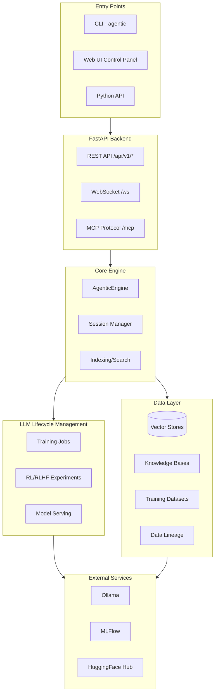

# Chunk: 757ee070376b_0

- source: `docs/architecture.md`
- lines: 1-123
- chunk: 1/6

```
# Architecture Overview

This document describes the architecture and design decisions of the Agentic Assistants framework.

## System Architecture

```
Entry Points
----------------------------
CLI (Click)  |  Python Imports  |  Startup Scripts (bash/ps1)
             |
             v
Configuration Layer
----------------------------
AgenticConfig  |  OllamaSettings  |  MLFlow/TelemetrySettings
             |
             v
Core Components
----------------------------
OllamaManager  |  MLFlowTracker  |  TelemetryManager
             |
             v
Framework Adapters
----------------------------
CrewAIAdapter  |  LangGraphAdapter
             |
             v
External Services
----------------------------
Ollama (LLM)  |  MLFlow Server  |  OTEL Collector / Jaeger
```

## Expanded Architecture (Server + UI + Pipelines + LLM Lifecycle)

This repo now includes a FastAPI backend, Next.js control panel, Kedro-inspired pipelines, knowledge bases, and comprehensive LLM lifecycle management.




## Component Design

### Configuration (Pydantic Settings)

The configuration system uses Pydantic Settings for:
- Type validation
- Environment variable parsing
- Nested configuration objects
- Default values with documentation

```python
class AgenticConfig(BaseSettings):
    mlflow_enabled: bool = True
    _ollama: OllamaSettings  # Lazy-loaded nested config
```

### Core Components

#### OllamaManager
- Manages Ollama server lifecycle
- Handles model operations (pull, list, delete)
- Provides chat interface
- Cross-platform support (Windows, macOS, Linux)

#### MLFlowTracker
- Context manager for experiment runs
- Runtime enable/disable (no crashes when disabled)
- Decorators for automatic tracking
- Agent-specific logging methods

#### TelemetryManager
- OpenTelemetry SDK initialization
- Span creation with attributes
- Metrics recording
- NoOp implementations when disabled

### Adapters Pattern
```
