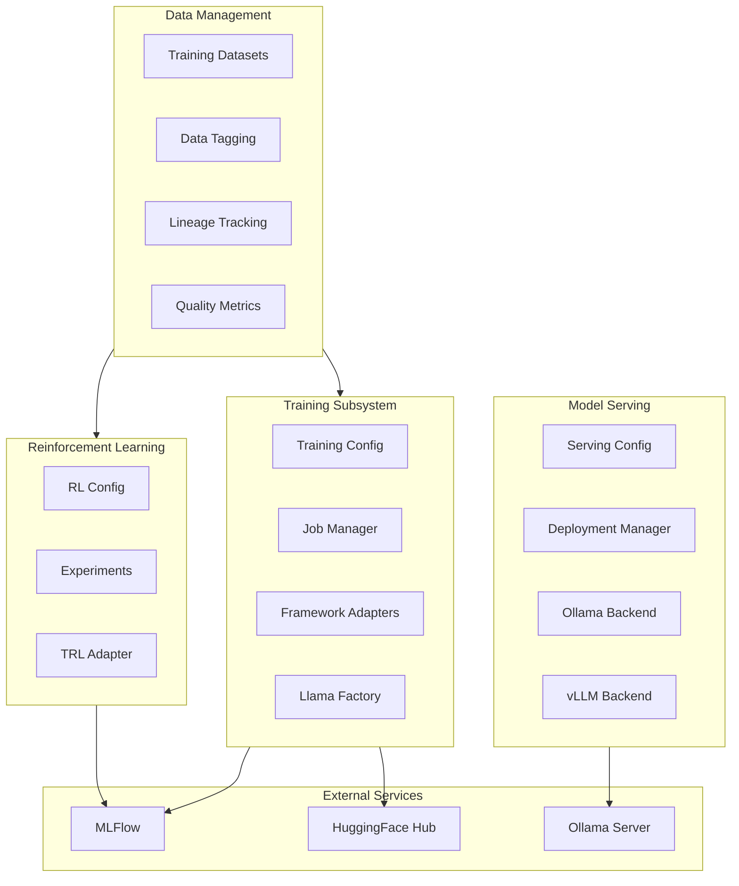

# Chunk: 757ee070376b_2

- source: `docs/architecture.md`
- lines: 219-323
- chunk: 3/6

```
azy Loading
- Sub-configurations loaded on first access
- MLFlow/OTEL only initialized when used
- Import costs minimized

### Batching
- OpenTelemetry uses BatchSpanProcessor
- MLFlow batches artifact uploads
- Reduces network overhead

### Async Support
- Ollama manager uses httpx (async-capable)
- Future: async adapters for concurrent agents

## Security Considerations

### API Keys
- Never logged or stored in artifacts
- Environment variables only
- Not included in MLFlow parameters

### Local-First
- Default configuration works offline
- No external service dependencies required
- Data stays on your machine

### Container Isolation
- Docker services run in separate network
- Non-root container user
- Read-only config mounts

---

## LLM Lifecycle Management

The framework includes comprehensive support for custom LLM development, from training through deployment.

### LLM Lifecycle Architecture



### Training Subsystem

The training subsystem (src/agentic_assistants/training/) provides:

#### Components

| Component | File | Purpose |
|-----------|------|---------|
| **TrainingConfig** | config.py | Pydantic models for training configuration (LoRA, QLoRA, full) |
| **TrainingJob** | jobs.py | Job lifecycle management and status tracking |
| **TrainingDataset** | datasets.py | Dataset registration, validation, and loading |
| **TrainingFrameworkAdapter** | frameworks/base.py | Abstract base for training framework integrations |
| **LlamaFactoryAdapter** | frameworks/llama_factory.py | Llama Factory integration |
| **ModelExporter** | export.py | Export models to various formats (HF, GGUF, ONNX) |
| **ModelQuantizer** | quantization.py | Model quantization utilities |
| **KnowledgeDistiller** | distillation.py | Knowledge distillation support |

#### Training Flow

```
1. User creates TrainingConfig with model/dataset/hyperparameters
2. TrainingJobManager creates TrainingJob with unique ID
```
