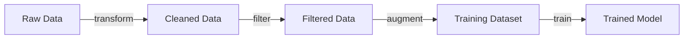

# Chunk: 757ee070376b_4

- source: `docs/architecture.md`
- lines: 389-485
- chunk: 5/6

```
**DeploymentManager** | manager.py | Orchestrates deployments across backends |
| **OllamaBackend** | backends/ollama.py | Ollama integration (GGUF models) |
| **VLLMBackend** | backends/vllm.py | vLLM integration (future) |
| **TGIBackend** | backends/tgi.py | Text Generation Inference (future) |

#### Supported Backends

| Backend | Use Case | Model Format |
|---------|----------|--------------|
| **Ollama** | Local inference, development | GGUF |
| **vLLM** | High-throughput serving | HuggingFace |
| **TGI** | Production deployments | HuggingFace |

#### Deployment Flow

```
1. User requests model deployment with target backend
2. DeploymentManager validates model format
3. If needed, model converted (e.g., to GGUF for Ollama)
4. Backend-specific deployment initiated
5. Health checks verify endpoint availability
6. Deployment status tracked in database
```

### Data Observability Subsystem

The data observability subsystem (src/agentic_assistants/data/training/) provides:

#### Components

| Component | File | Purpose |
|-----------|------|---------|
| **DataTaggingSystem** | tagging.py | Hierarchical tagging for datasets |
| **DataLineageTracker** | lineage.py | Track data transformations and provenance |
| **DataQualityAnalyzer** | quality.py | Quality metrics and validation |

#### Tagging System

```python
class TagCategory(str, Enum):
    DATA_TYPE = "data_type"     # instruct, preference, completion
    QUALITY = "quality"         # high_quality, needs_review
    DOMAIN = "domain"           # code, general, medical
    SOURCE = "source"           # synthetic, human
    PROCESSING = "processing"   # cleaned, augmented
```

#### Lineage Tracking



The lineage tracker records:
- Source datasets and versions
- Transformation steps applied
- Filters and sampling
- Quality metrics at each stage
- Final model association

### HuggingFace Hub Integration

The HuggingFace integration (src/agentic_assistants/integrations/huggingface.py) provides:

#### Capabilities
- **Model Push/Pull**: Upload trained models, download base models
- **Dataset Push/Pull**: Share training datasets
- **Model Cards**: Auto-generate documentation
- **Local Fallback**: Works offline with local storage

#### Usage Pattern

```python
from agentic_assistants.integrations.huggingface import HuggingFaceHubIntegration

hf = HuggingFaceHubIntegration(token="hf_xxx")

# Push model with auto-generated model card
hf.push_model(
    model_path="./outputs/my-model",
    repo_id="username/my-model",
    model_card=hf.create_model_card(
        model_name="My Custom Model",
        base_model="meta-llama/Llama-3.2-3B",
        description="Fine-tuned for code generation",
        training_method="lora",
    ),
)
```

### Database Schema
```
