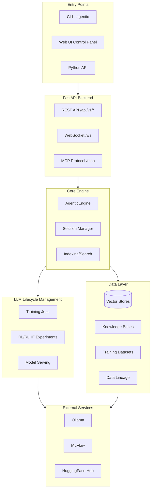
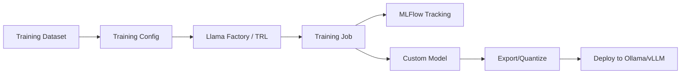
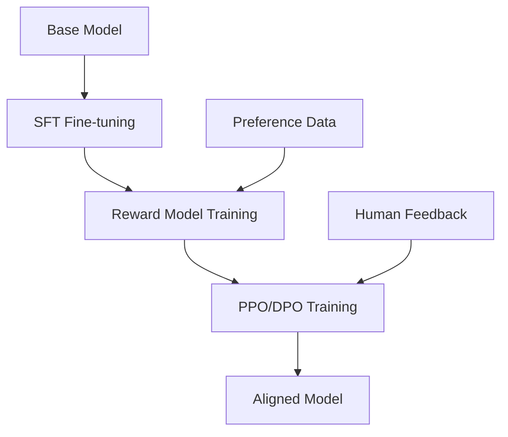
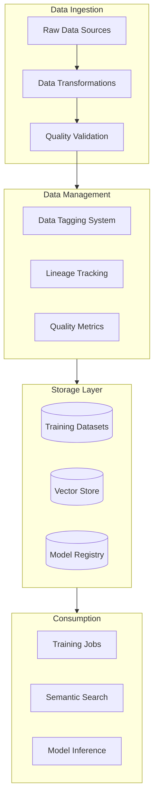

# Agentic Assistants

A comprehensive local framework for building multi-agent AI systems, custom LLM development, and MLOps/LLMOps best practices.

[](https://www.python.org/downloads/)
[](https://opensource.org/licenses/MIT)

## Overview

Agentic Assistants provides a unified platform for the complete AI development lifecycle:

- **Multi-Agent Experimentation**: Build and test agent teams with CrewAI and LangGraph
- **Custom LLM Training**: Fine-tune and train domain-specific models with LoRA, QLoRA, and full fine-tuning
- **Reinforcement Learning**: Implement RLHF, DPO, and preference-based alignment
- **Model Serving**: Deploy custom models via Ollama, vLLM, or TGI
- **Hybrid LLM Routing**: Use Ollama, local Hugging Face (`transformers`), or OpenAI-compatible endpoints
- **Data Observability**: Track training data lineage, quality, and governance
- **MLOps Integration**: Built-in MLFlow tracking for experiment comparison
- **Observability**: OpenTelemetry tracing and metrics out of the box

---

## System Architecture



---

## LLM Training Pipeline

The training system supports the complete model development workflow:



### Training Methods

| Method | Description | Use Case |
|--------|-------------|----------|
| **Full Fine-tuning** | Update all model weights | Maximum customization, requires significant compute |
| **LoRA** | Low-Rank Adaptation | Efficient fine-tuning with minimal parameters |
| **QLoRA** | Quantized LoRA | Memory-efficient training on consumer GPUs |

---

## Reinforcement Learning Pipeline

Implement human preference alignment with multiple RL methods:



### Supported RL Methods

| Method | Description |
|--------|-------------|
| **RLHF** | Full Reinforcement Learning from Human Feedback with reward model |
| **DPO** | Direct Preference Optimization - simpler, no reward model needed |
| **PPO** | Proximal Policy Optimization for fine-grained control |
| **ORPO** | Odds Ratio Preference Optimization |
| **KTO** | Kahneman-Tversky Optimization |

---

## Data Flow Architecture



---

## Features

| Feature | Description |
|---------|-------------|
| **CLI Interface** | Manage Ollama, MLFlow, training jobs, and run experiments from the command line |
| **Python API** | Import and use directly in your code |
| **LLM Training** | Fine-tune models with LoRA, QLoRA, or full fine-tuning via Llama Factory |
| **RL/RLHF** | Implement DPO, PPO, RLHF for model alignment using TRL |
| **Model Serving** | Deploy custom models to Ollama, vLLM, or TGI |
| **HuggingFace Integration** | Push/pull models and datasets from HuggingFace Hub |
| **Data Observability** | Tag, track lineage, and monitor quality of training data |
| **CrewAI Adapter** | Build multi-agent teams with role-based collaboration |
| **LangGraph Adapter** | Create stateful workflows with conditional logic |
| **MLFlow Tracking** | Automatic experiment logging, metrics, and artifacts |
| **OpenTelemetry** | Distributed tracing across agent interactions |
| **Server (REST + WebSocket + MCP)** | FastAPI backend for control panel APIs, indexing/search, and MCP over WebSocket |
| **Web UI Control Panel** | Next.js UI for projects/agents/flows/pipelines/knowledge/training/models |
| **Vector Search & Indexing** | Chunking + indexing into pluggable vector stores (LanceDB/Chroma) |
| **Pipelines (Kedro-inspired)** | DAG pipelines, runners, and templates for ingestion/monitoring workflows |
| **Kubernetes & Storage Integrations** | Optional k8s + MinIO + Redis + Feast integration paths |
| **Docker Support** | Optional containerized infrastructure |

---

## Use Cases

### Custom LLM Development
Train domain-specific models for specialized tasks like code generation, document analysis, or domain expertise. Use LoRA for efficient fine-tuning or full fine-tuning for maximum customization.

### Agent Enhancement
Create optimized models specifically designed for agentic workflows. Train models that excel at tool use, planning, and multi-step reasoning for improved agent performance.

### Research & Experimentation
Compare training methods, hyperparameters, and architectures with full MLFlow tracking. Visualize metrics, compare runs, and reproduce experiments.

### Model Serving at Scale
Deploy custom models via Ollama for local inference, vLLM for high-throughput serving, or TGI for production deployments. Export models to GGUF for efficient inference.

### Data Observability & Governance
Track data lineage from raw sources through transformations to model training. Tag datasets for organization, monitor quality metrics, and maintain audit trails for ML governance.

### Multi-Agent Systems
Build sophisticated multi-agent teams with CrewAI or stateful workflows with LangGraph. Combine custom models with off-the-shelf LLMs for specialized agent capabilities.

---

## Quick Start

### Prerequisites

- Python **3.10–3.11** (the project targets `>=3.10,<3.12`)
- [Poetry](https://python-poetry.org/docs/#installation)
- [Ollama](https://ollama.ai)
- CUDA-capable GPU (recommended for training)

### Hybrid LLM Quick Config (Assistant + Testing)

```bash
# Global provider defaults
LLM_PROVIDER=ollama
LLM_MODEL=llama3.2

# Optional OpenAI-compatible endpoint (vLLM / TGI / compatible gateways)
# LLM_PROVIDER=openai_compatible
# LLM_MODEL=meta-llama/Llama-3.1-8B-Instruct
# LLM_OPENAI_BASE_URL=http://localhost:8000/v1
# OPENAI_API_KEY=...

# Optional HF local execution
# LLM_PROVIDER=huggingface_local
# LLM_HF_LOCAL_MODEL=meta-llama/Llama-3.2-3B-Instruct
# LLM_HF_EXECUTION_MODE=hybrid

# Optional evaluation override
# TESTING_EVAL_PROVIDER=openai_compatible
# TESTING_EVAL_MODEL=meta-llama/Llama-3.1-8B-Instruct
```

### Installation

```bash
# Clone the repository
git clone https://github.com/julianwiley/agentic_assistants.git
cd agentic_assistants

# Install dependencies
poetry install

# Activate virtual environment
poetry shell

# Initialize configuration
agentic config init
```

### Start Services

```bash
# Unix/macOS
./scripts/start.sh

# Windows PowerShell
.\scripts\start.ps1
```

### Web UI Control Panel

```bash
# Windows PowerShell
.\scripts\start-webui.ps1

# Linux/macOS/Git Bash
./scripts/start-webui.sh
```

### JupyterLab (default IDE)

```bash
# Unix/macOS
./scripts/start-lab.sh

# Windows PowerShell
.\scripts\start-lab.ps1
```

JupyterLab serves on port `3000` by default (config in `lab/jupyter_lab_config.py`). Set `MLFLOW_TRACKING_URI` to point at your MLflow server.

### Docker Compose

```bash
# JupyterLab default IDE
docker-compose up -d agentic-ide

# MLflow server
docker-compose up -d mlflow

# All services with Jaeger for tracing
docker-compose up -d
```

### Pull a Model

```bash
agentic ollama pull llama3.2
```

### Run Your First Experiment

```bash
# Simple chat example
agentic run examples/simple_ollama_chat.py

# CrewAI multi-agent example
agentic run examples/crewai_research_team.py

# LangGraph workflow example
agentic run examples/langgraph_workflow.py
```

---

## Usage

### CLI

```bash
# Ollama management
agentic ollama start              # Start Ollama server
agentic ollama list               # List available models
agentic ollama pull mistral       # Pull a new model

# MLFlow tracking
agentic mlflow start              # Start tracking server
agentic mlflow ui                 # Open MLFlow UI in browser

# Server (REST + MCP)
agentic server start              # Start FastAPI server (REST + MCP WebSocket)

# Run experiments
agentic run script.py --experiment-name "my-exp"

# Configuration
agentic config show               # View current settings
agentic services status           # Check all services

# Indexing & search
agentic index ./src --collection my-project
agentic search "pipeline runner" --collection my-project
```

### Python API

```python
from agentic_assistants import AgenticConfig, OllamaManager
from agentic_assistants.adapters import CrewAIAdapter

# Initialize
config = AgenticConfig()
adapter = CrewAIAdapter(config)

# Create an agent
researcher = adapter.create_ollama_agent(
    role="Research Analyst",
    goal="Find accurate information on topics",
    backstory="Expert researcher with years of experience",
)

# Create and run a crew
crew = adapter.create_crew(
    agents=[researcher],
    tasks=[...],
)

result = adapter.run_crew(
    crew,
    inputs={"topic": "AI agents"},
    experiment_name="research-v1",
)
```

### Training API

```python
from agentic_assistants.training import TrainingConfig, TrainingMethod, LoRAConfig

# Configure a LoRA training job
config = TrainingConfig(
    base_model="meta-llama/Llama-3.2-3B",
    output_name="my-custom-model",
    method=TrainingMethod.LORA,
    lora_config=LoRAConfig(r=16, lora_alpha=32),
    dataset_id="my-dataset",
    num_epochs=3,
    learning_rate=2e-4,
)

# Start training (integrates with MLFlow automatically)
from agentic_assistants.training import TrainingJobManager
manager = TrainingJobManager()
job = manager.create_job(config)
manager.start_job(job.id)
```

### RL/RLHF API

```python
from agentic_assistants.rl import RLConfig, RLMethod, DPOConfig

# Configure a DPO experiment
config = RLConfig(
    base_model="my-sft-model",
    output_name="my-aligned-model",
    method=RLMethod.DPO,
    preference_dataset_id="preference-data",
    dpo_config=DPOConfig(beta=0.1, learning_rate=5e-7),
)
```

### Model Serving

```python
from agentic_assistants.serving import DeploymentManager, ServingBackend

# Deploy a model to Ollama
manager = DeploymentManager()
deployment = manager.deploy(
    model_path="./outputs/my-model",
    backend=ServingBackend.OLLAMA,
    model_name="my-custom-llm",
)
```

### Notebooks

Interactive notebooks for learning:

1. **01_getting_started.ipynb** - Setup verification and basics
2. **02_crewai_basics.ipynb** - Multi-agent teams with CrewAI
3. **03_langgraph_basics.ipynb** - Stateful workflows with LangGraph
4. **04_mlflow_experiments.ipynb** - Experiment tracking and comparison

```bash
# Launch Jupyter
poetry run jupyter notebook notebooks/
```

---

## Project Structure

```
agentic_assistants/
├── src/agentic_assistants/         # Main package
│   ├── cli.py                      # CLI implementation
│   ├── config.py                   # Configuration management
│   ├── engine.py                   # AgenticEngine facade
│   ├── core/                       # Core components
│   │   ├── ollama.py               # Ollama manager
│   │   ├── mlflow_tracker.py       # MLFlow integration
│   │   └── telemetry.py            # OpenTelemetry setup
│   ├── adapters/                   # Framework adapters
│   │   ├── crewai_adapter.py       # CrewAI integration
│   │   └── langgraph_adapter.py    # LangGraph integration
│   ├── training/                   # LLM Training subsystem
│   │   ├── config.py               # Training configurations
│   │   ├── jobs.py                 # Job management
│   │   ├── datasets.py             # Dataset handling
│   │   ├── frameworks/             # Training framework adapters
│   │   │   ├── llama_factory.py    # Llama Factory integration
│   │   │   └── base.py             # Base adapter interface
│   │   ├── export.py               # Model export utilities
│   │   ├── quantization.py         # Quantization support
│   │   └── distillation.py         # Knowledge distillation
│   ├── rl/                         # Reinforcement Learning
│   │   ├── config.py               # RL configurations (DPO, PPO, RLHF)
│   │   ├── experiments.py          # Experiment management
│   │   └── adapters/               # RL framework adapters
│   │       └── trl_adapter.py      # TRL integration
│   ├── serving/                    # Model Serving
│   │   ├── config.py               # Serving configurations
│   │   ├── manager.py              # Deployment manager
│   │   └── backends/               # Serving backends
│   │       └── ollama.py           # Ollama backend
│   ├── data/                       # Data layer
│   │   ├── training/               # Training data management
│   │   │   ├── tagging.py          # Data tagging system
│   │   │   ├── lineage.py          # Lineage tracking
│   │   │   └── quality.py          # Quality metrics
│   │   └── ...                     # Other data utilities
│   ├── integrations/               # External integrations
│   │   └── huggingface.py          # HuggingFace Hub integration
│   ├── server/                     # FastAPI server
│   │   ├── rest.py                 # REST API assembly
│   │   ├── api/                    # API routers
│   │   │   ├── training.py         # Training endpoints
│   │   │   └── models.py           # Models endpoints
│   │   └── websocket.py            # WebSocket handler
│   ├── knowledge/                  # Knowledge bases
│   ├── pipelines/                  # DAG pipelines
│   ├── vectordb/                   # Vector store backends
│   └── utils/                      # Utilities
├── webui/                          # Next.js Control Panel
│   └── src/app/
│       ├── models/                 # Model management pages
│       │   ├── training/           # Training job pages
│       │   └── tuning/             # RL tuning pages
│       └── data/training/          # Data observability pages
├── examples/                       # Example scripts
├── notebooks/                      # Jupyter notebooks
├── docs/                           # Documentation
├── scripts/                        # Startup/shutdown scripts
├── tests/                          # Test suite
├── docker-compose.yml              # Optional Docker services
└── pyproject.toml                  # Project configuration
```

---

## Configuration

Configuration via environment variables or `.env` file:

```bash
# Core settings
AGENTIC_MLFLOW_ENABLED=true
AGENTIC_LOG_LEVEL=INFO

# Ollama
OLLAMA_HOST=http://localhost:11434
OLLAMA_DEFAULT_MODEL=llama3.2

# MLFlow
MLFLOW_TRACKING_URI=http://localhost:5000
MLFLOW_EXPERIMENT_NAME=agentic-experiments

# OpenTelemetry
OTEL_EXPORTER_OTLP_ENDPOINT=http://localhost:4317

# HuggingFace (optional)
HF_TOKEN=hf_xxx
```

See [Configuration Guide](docs/configuration.md) for all options.

---

## Documentation

- [Installation Guide](docs/installation.md)
- [CLI Reference](docs/cli_reference.md)
- [API Reference](docs/api_reference.md)
- [Configuration](docs/configuration.md)
- [Architecture](docs/architecture.md)
- [LLM Training Guide](docs/llm_training.md)
- [RL/RLHF Tuning Guide](docs/rl_tuning.md)
- [Model Serving Guide](docs/model_serving.md)
- [Data Observability](docs/data_observability.md)

---

## Development

```bash
# Install dev dependencies
poetry install --with dev

# Run tests
pytest

# Linting
ruff check src/

# Type checking
mypy src/
```

---

## Observability

### MLFlow (Experiment Tracking)

- **URL**: http://localhost:5000
- Compare experiments, view metrics, download artifacts
- Track training jobs, RL experiments, and model performance

### Jaeger (Distributed Tracing)

- **URL**: http://localhost:16686 (requires Docker)
- Trace agent interactions, view latencies

---

## Recommended Future Enhancements

The following features are planned or recommended for future development:

### Training & Optimization
- [ ] Multi-node distributed training with DeepSpeed/FSDP
- [ ] AutoML for hyperparameter optimization
- [ ] Mixture of Experts (MoE) training support
- [ ] Continuous training pipelines with data drift detection

### Evaluation & Testing
- [ ] Comprehensive evaluation framework with standard benchmarks
- [ ] Model A/B testing infrastructure
- [ ] Automated regression testing for model updates
- [ ] Red teaming and safety evaluation tools

### Deployment & Operations
- [ ] Model versioning with rollback capabilities
- [ ] Canary deployments for model updates
- [ ] Auto-scaling based on inference load
- [ ] Cost optimization for cloud deployments

### Data & Governance
- [ ] Federated learning support
- [ ] Data anonymization and PII detection
- [ ] Model cards and documentation generation
- [ ] Compliance reporting (GDPR, SOC2)

### Integration & Ecosystem
- [ ] Additional agent frameworks (AutoGen, LlamaIndex agents)
- [ ] Prompt versioning and management
- [ ] Vector store integrations (Pinecone, Weaviate, Qdrant)
- [ ] Cloud provider integrations (AWS, GCP, Azure)

---

## Roadmap

- [x] Multi-agent support (CrewAI, LangGraph)
- [x] MLFlow experiment tracking
- [x] Vector search and indexing
- [x] Web UI control panel
- [x] LLM training with LoRA/QLoRA
- [x] RLHF/DPO alignment
- [x] Model serving (Ollama, vLLM, TGI)
- [x] Data observability (tagging, lineage)
- [x] HuggingFace Hub integration
- [ ] Additional agent frameworks (AutoGen, LlamaIndex)
- [ ] Prompt versioning and management
- [ ] Evaluation framework for agent outputs
- [ ] Distributed training support

---

## Contributing

Contributions are welcome! Please see our contributing guidelines.

1. Fork the repository
2. Create a feature branch
3. Make your changes
4. Run tests (`pytest`)
5. Submit a pull request

---

## License

MIT License - see [LICENSE](LICENSE) for details.

---

## Acknowledgments

Built with:
- [CrewAI](https://github.com/joaomdmoura/crewAI) - Multi-agent orchestration
- [LangGraph](https://github.com/langchain-ai/langgraph) - Stateful workflows
- [Ollama](https://ollama.ai) - Local LLM runtime
- [MLFlow](https://mlflow.org) - Experiment tracking
- [OpenTelemetry](https://opentelemetry.io) - Observability
- [Llama Factory](https://github.com/hiyouga/LLaMA-Factory) - LLM training
- [TRL](https://github.com/huggingface/trl) - Reinforcement learning
- [HuggingFace](https://huggingface.co) - Model hub and transformers