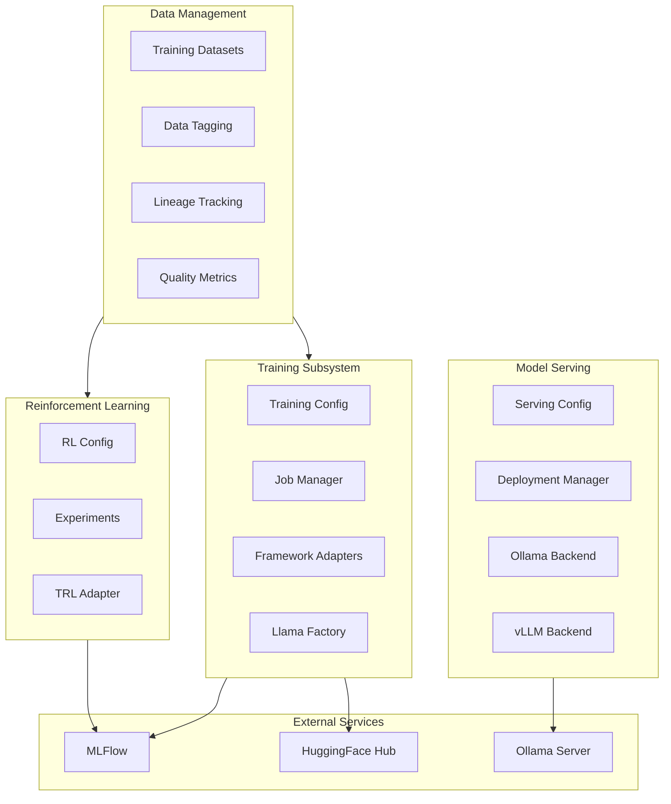
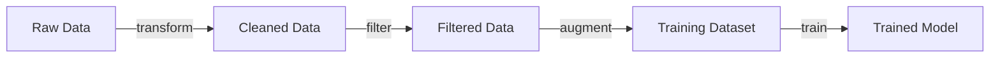

# Architecture Overview

This document describes the architecture and design decisions of the Agentic Assistants framework.

## System Architecture

```
┌─────────────────────────────────────────────────────────────────────────────┐
│                              Entry Points                                    │
├─────────────────┬─────────────────────┬─────────────────────────────────────┤
│   CLI (Click)   │   Python Imports    │   Startup Scripts (bash/ps1)       │
└────────┬────────┴──────────┬──────────┴─────────────────────────────────────┘
         │                   │
         ▼                   ▼
┌─────────────────────────────────────────────────────────────────────────────┐
│                         Configuration Layer                                  │
│  ┌─────────────────┐  ┌─────────────────┐  ┌─────────────────────────────┐  │
│  │  AgenticConfig  │  │  OllamaSettings │  │  MLFlow/TelemetrySettings   │  │
│  └─────────────────┘  └─────────────────┘  └─────────────────────────────┘  │
└─────────────────────────────────────────────────────────────────────────────┘
         │
         ▼
┌─────────────────────────────────────────────────────────────────────────────┐
│                            Core Components                                   │
│  ┌─────────────────┐  ┌─────────────────┐  ┌─────────────────────────────┐  │
│  │  OllamaManager  │  │  MLFlowTracker  │  │    TelemetryManager         │  │
│  │  - start/stop   │  │  - experiments  │  │    - tracing                │  │
│  │  - models       │  │  - metrics      │  │    - metrics                │  │
│  │  - chat         │  │  - artifacts    │  │    - spans                  │  │
│  └─────────────────┘  └─────────────────┘  └─────────────────────────────┘  │
└─────────────────────────────────────────────────────────────────────────────┘
         │
         ▼
┌─────────────────────────────────────────────────────────────────────────────┐
│                          Framework Adapters                                  │
│  ┌───────────────────────────┐  ┌───────────────────────────────────────┐   │
│  │      CrewAIAdapter        │  │         LangGraphAdapter              │   │
│  │  - create_ollama_agent    │  │  - wrap_node                          │   │
│  │  - run_crew               │  │  - run_graph                          │   │
│  │  - tracking integration   │  │  - stream_graph                       │   │
│  └───────────────────────────┘  └───────────────────────────────────────┘   │
└─────────────────────────────────────────────────────────────────────────────┘
         │
         ▼
┌─────────────────────────────────────────────────────────────────────────────┐
│                         External Services                                    │
│  ┌─────────────────┐  ┌─────────────────┐  ┌─────────────────────────────┐  │
│  │     Ollama      │  │  MLFlow Server  │  │  OTEL Collector / Jaeger   │  │
│  │  (LLM Runtime)  │  │  (Experiments)  │  │  (Tracing)                 │  │
│  └─────────────────┘  └─────────────────┘  └─────────────────────────────┘  │
└─────────────────────────────────────────────────────────────────────────────┘
```

## Expanded Architecture (Server + UI + Pipelines)

This repo has grown beyond “CLI + adapters”: it now includes a FastAPI backend, a Next.js control panel, and Kedro-inspired pipeline + knowledge base subsystems.

```
┌──────────────────────────┐        ┌──────────────────────────┐
│         Web UI           │        │           CLI            │
│  Next.js Control Panel   │        │         (Click)          │
│  webui/ (port 3000)      │        │  agentic ...             │
└─────────────┬────────────┘        └─────────────┬────────────┘
              │                                   │
              ▼                                   ▼
┌─────────────────────────────────────────────────────────────────────────────┐
│                           FastAPI Server (port 8080)                         │
│  REST: /api/v1/*  |  Legacy: /search /index /chat /sessions  |  WS: /ws      │
│  MCP over WebSocket: /mcp                                                     │
└───────────────────────────────┬─────────────────────────────────────────────┘
                                ▼
┌─────────────────────────────────────────────────────────────────────────────┐
│                               AgenticEngine                                  │
│  - sessions  - indexing/search  - vector store  - pipelines  - knowledge      │
└───────────────┬───────────────────────────────┬─────────────────────────────┘
                ▼                               ▼
┌──────────────────────────┐        ┌─────────────────────────────────────────┐
│     Vector Stores         │        │      Data + Pipelines + Knowledge       │
│  LanceDB / ChromaDB       │        │  data/  pipelines/  knowledge/          │
│  data/vectors             │        │  + optional k8s/minio/redis integrations│
└──────────────────────────┘        └─────────────────────────────────────────┘
```

## Component Design

### Configuration (Pydantic Settings)

The configuration system uses Pydantic Settings for:
- Type validation
- Environment variable parsing
- Nested configuration objects
- Default values with documentation

```python
class AgenticConfig(BaseSettings):
    mlflow_enabled: bool = True
    _ollama: OllamaSettings  # Lazy-loaded nested config
```

### Core Components

#### OllamaManager
- Manages Ollama server lifecycle
- Handles model operations (pull, list, delete)
- Provides chat interface
- Cross-platform support (Windows, macOS, Linux)

#### MLFlowTracker
- Context manager for experiment runs
- Runtime enable/disable (no crashes when disabled)
- Decorators for automatic tracking
- Agent-specific logging methods

#### TelemetryManager
- OpenTelemetry SDK initialization
- Span creation with attributes
- Metrics recording
- NoOp implementations when disabled

### Core Foundation Layer

The reusable foundation layer lives in `src/agentic_assistants/core/foundation/` and
provides cross-cutting abstractions used by adapters, runners, and API boundaries:

- `base_models.py`: generic entities, mixins, envelope and pagination models
- `types.py`: canonical aliases plus protocols for catalogs/hooks/execution payloads
- `dto.py`: configurable model<->DTO transformations for boundary safety
- `repository.py` / `service.py`: persistence and orchestration contracts
- `serialization.py`: pluggable json/pydantic/msgspec serializer backends
- `state_machine.py`: typed graph execution with optional checkpointing
- `clients/` and `utils/`: optional MLOps/DataOps facades and helper primitives

Legacy modules under `src/agentic_assistants/core/` re-export these implementations
to preserve backward compatibility for existing imports.

### Adapters Pattern

Adapters wrap external frameworks with:
1. **Observability integration** - Auto-tracking with MLFlow/OTEL
2. **Convenience methods** - Simplified API for common tasks
3. **Configuration** - Consistent config across frameworks

```python
class BaseAdapter(ABC):
    def __init__(self, config):
        self.tracker = MLFlowTracker(config)
        self.telemetry = TelemetryManager(config)
    
    @contextmanager
    def track_run(self, name):
        # Combined MLFlow + OTEL tracking
        with self.tracker.start_run(name):
            with self.telemetry.span(name):
                yield
```

## Data Flow

### Experiment Tracking Flow

```
User Code → Adapter → MLFlowTracker → MLFlow Server
                   ↘
                    TelemetryManager → OTEL Collector → Jaeger
```

### Agent Execution Flow

```
1. User calls adapter.run_crew(crew, inputs)
2. Adapter starts MLFlow run + OTEL span
3. Adapter executes framework-specific code
4. Framework makes calls to Ollama
5. Results logged to MLFlow as artifacts
6. Metrics recorded to OTEL
7. Run completed, data persisted
```

## Design Decisions

### Why Pydantic Settings?

- Type safety with validation
- Automatic environment variable parsing
- Documentation via Field descriptions
- Nested configuration support

### Why Context Managers?

- Automatic cleanup (end runs, flush telemetry)
- Exception handling without data loss
- Composable (can nest tracking + tracing)
- Familiar Python pattern

### Why Adapters Instead of Monkey Patching?

- Explicit integration (user controls when tracking happens)
- No surprises in production
- Easier to debug
- Framework-independent interface

### Why Optional Docker?

- Lower barrier to entry (local-first)
- Production-ready path available
- Full observability stack when needed
- Works on machines without Docker

## Extension Points

### Adding New Adapters

```python
from agentic_assistants.adapters.base import BaseAdapter

class MyFrameworkAdapter(BaseAdapter):
    def run(self, workflow, inputs):
        with self.track_run("my-workflow"):
            return workflow.execute(inputs)
```

### Custom Telemetry Exporters

```python
# Configure via environment
OTEL_EXPORTER_OTLP_ENDPOINT=http://custom-collector:4317
```

### Custom MLFlow Backend

```python
# Use cloud storage
MLFLOW_TRACKING_URI=databricks://...
MLFLOW_ARTIFACT_LOCATION=s3://bucket/artifacts
```

## Performance Considerations

### Lazy Loading

- Sub-configurations loaded on first access
- MLFlow/OTEL only initialized when used
- Import costs minimized

### Batching

- OpenTelemetry uses BatchSpanProcessor
- MLFlow batches artifact uploads
- Reduces network overhead

### Async Support

- Ollama manager uses httpx (async-capable)
- Future: async adapters for concurrent agents

## Security Considerations

### API Keys

- Never logged or stored in artifacts
- Environment variables only
- Not included in MLFlow parameters

### Local-First

- Default configuration works offline
- No external service dependencies required
- Data stays on your machine

### Container Isolation

- Docker services run in separate network
- Non-root container user
- Read-only config mounts

---

## LLM Lifecycle Management

The framework includes comprehensive support for custom LLM development, from training through deployment.

### LLM Lifecycle Architecture



### Training Subsystem

The training subsystem (`src/agentic_assistants/training/`) provides:

#### Components

| Component | File | Purpose |
|-----------|------|---------|
| **TrainingConfig** | `config.py` | Pydantic models for training configuration (LoRA, QLoRA, full) |
| **TrainingJob** | `jobs.py` | Job lifecycle management and status tracking |
| **TrainingDataset** | `datasets.py` | Dataset registration, validation, and loading |
| **TrainingFrameworkAdapter** | `frameworks/base.py` | Abstract base for training framework integrations |
| **LlamaFactoryAdapter** | `frameworks/llama_factory.py` | Llama Factory integration |
| **ModelExporter** | `export.py` | Export models to various formats (HF, GGUF, ONNX) |
| **ModelQuantizer** | `quantization.py` | Model quantization utilities |
| **KnowledgeDistiller** | `distillation.py` | Knowledge distillation support |

#### Training Flow

```
1. User creates TrainingConfig with model/dataset/hyperparameters
2. TrainingJobManager creates TrainingJob with unique ID
3. Job queued and picked up by framework adapter
4. Framework adapter (Llama Factory) executes training
5. MLFlow tracks parameters, metrics, checkpoints
6. On completion, model registered in CustomModelRegistry
7. Optional: Export to GGUF, push to HuggingFace Hub
```

#### Configuration Model

```python
class TrainingConfig(BaseModel):
    base_model: str           # HuggingFace model ID or local path
    output_name: str          # Name for trained model
    method: TrainingMethod    # FULL, LORA, QLORA
    lora_config: LoRAConfig   # LoRA-specific settings
    dataset_id: str           # Training dataset ID
    num_epochs: int           # Training epochs
    learning_rate: float      # Learning rate
    batch_size: int           # Batch size
    # ... additional hyperparameters
```

### Reinforcement Learning Subsystem

The RL subsystem (`src/agentic_assistants/rl/`) supports preference-based alignment:

#### Components

| Component | File | Purpose |
|-----------|------|---------|
| **RLConfig** | `config.py` | Configuration for RLHF, DPO, PPO, ORPO, KTO |
| **RLExperiment** | `experiments.py` | Experiment tracking and management |
| **RLFrameworkAdapter** | `adapters/base.py` | Abstract base for RL framework integrations |
| **TRLAdapter** | `adapters/trl_adapter.py` | HuggingFace TRL integration |
| **PreferenceData** | `config.py` | Preference data structures |
| **HumanFeedback** | `config.py` | Human feedback collection |

#### Supported Methods

| Method | Description | Implementation |
|--------|-------------|----------------|
| **DPO** | Direct Preference Optimization | TRL DPOTrainer |
| **PPO** | Proximal Policy Optimization | TRL PPOTrainer |
| **RLHF** | Full RLHF with reward model | TRL + custom reward model |
| **ORPO** | Odds Ratio Preference Optimization | TRL ORPOTrainer |
| **KTO** | Kahneman-Tversky Optimization | TRL KTOTrainer |

#### RLHF Pipeline

```
1. Base model fine-tuned with SFT (optional)
2. Preference data collected (chosen/rejected pairs)
3. Reward model trained on preferences (for PPO/RLHF)
4. Policy model trained with PPO or DPO
5. Human feedback collected iteratively
6. Model aligned and exported
```

### Model Serving Subsystem

The serving subsystem (`src/agentic_assistants/serving/`) manages model deployment:

#### Components

| Component | File | Purpose |
|-----------|------|---------|
| **ServingConfig** | `config.py` | Configuration for serving backends |
| **DeploymentManager** | `manager.py` | Orchestrates deployments across backends |
| **OllamaBackend** | `backends/ollama.py` | Ollama integration (GGUF models) |
| **VLLMBackend** | `backends/vllm.py` | vLLM integration (future) |
| **TGIBackend** | `backends/tgi.py` | Text Generation Inference (future) |

#### Supported Backends

| Backend | Use Case | Model Format |
|---------|----------|--------------|
| **Ollama** | Local inference, development | GGUF |
| **vLLM** | High-throughput serving | HuggingFace |
| **TGI** | Production deployments | HuggingFace |

#### Deployment Flow

```
1. User requests model deployment with target backend
2. DeploymentManager validates model format
3. If needed, model converted (e.g., to GGUF for Ollama)
4. Backend-specific deployment initiated
5. Health checks verify endpoint availability
6. Deployment status tracked in database
```

### Data Observability Subsystem

The data observability subsystem (`src/agentic_assistants/data/training/`) provides:

#### Components

| Component | File | Purpose |
|-----------|------|---------|
| **DataTaggingSystem** | `tagging.py` | Hierarchical tagging for datasets |
| **DataLineageTracker** | `lineage.py` | Track data transformations and provenance |
| **DataQualityAnalyzer** | `quality.py` | Quality metrics and validation |

#### Tagging System

```python
class TagCategory(str, Enum):
    DATA_TYPE = "data_type"     # instruct, preference, completion
    QUALITY = "quality"         # high_quality, needs_review
    DOMAIN = "domain"           # code, general, medical
    SOURCE = "source"           # synthetic, human
    PROCESSING = "processing"   # cleaned, augmented
```

#### Lineage Tracking



The lineage tracker records:
- Source datasets and versions
- Transformation steps applied
- Filters and sampling
- Quality metrics at each stage
- Final model association

### HuggingFace Hub Integration

The HuggingFace integration (`src/agentic_assistants/integrations/huggingface.py`) provides:

#### Capabilities

- **Model Push/Pull**: Upload trained models, download base models
- **Dataset Push/Pull**: Share training datasets
- **Model Cards**: Auto-generate documentation
- **Local Fallback**: Works offline with local storage

#### Usage Pattern

```python
from agentic_assistants.integrations.huggingface import HuggingFaceHubIntegration

hf = HuggingFaceHubIntegration(token="hf_xxx")

# Push model with auto-generated model card
hf.push_model(
    model_path="./outputs/my-model",
    repo_id="username/my-model",
    model_card=hf.create_model_card(
        model_name="My Custom Model",
        base_model="meta-llama/Llama-3.2-3B",
        description="Fine-tuned for code generation",
        training_method="lora",
    ),
)
```

### Database Schema

The LLM lifecycle uses SQLite tables (migration `003_llm_training.sql`):

| Table | Purpose |
|-------|---------|
| `custom_models` | Model registry with metadata |
| `training_jobs` | Training job tracking |
| `training_datasets` | Dataset registry |
| `rl_experiments` | RL experiment tracking |
| `data_tags` | Tag definitions |
| `dataset_tags` | Tag assignments |
| `data_lineage` | Lineage records |
| `preference_data` | Preference pairs for RL |
| `human_feedback` | Human feedback collection |
| `model_deployments` | Deployment tracking |

### API Endpoints

#### Training API (`/api/v1/training`)

| Endpoint | Method | Purpose |
|----------|--------|---------|
| `/jobs` | POST | Create training job |
| `/jobs` | GET | List training jobs |
| `/jobs/{id}` | GET | Get job status |
| `/jobs/{id}/logs` | GET | Get job logs |
| `/jobs/{id}/stop` | POST | Stop running job |
| `/datasets` | POST | Register dataset |
| `/datasets` | GET | List datasets |
| `/export` | POST | Export model |
| `/distillation` | POST | Start distillation |

#### Models API (`/api/v1/models/custom`)

| Endpoint | Method | Purpose |
|----------|--------|---------|
| `/` | POST | Register model |
| `/` | GET | List models |
| `/{id}` | GET | Get model details |
| `/{id}` | PATCH | Update model |
| `/{id}` | DELETE | Delete model |
| `/{id}/deploy` | POST | Deploy model |
| `/{id}/metrics` | GET | Get model metrics |
